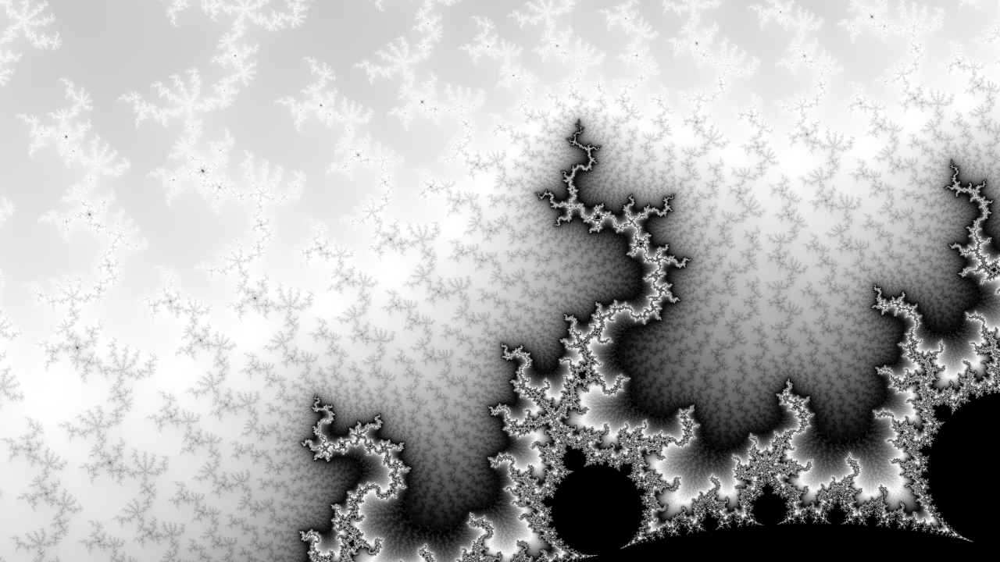
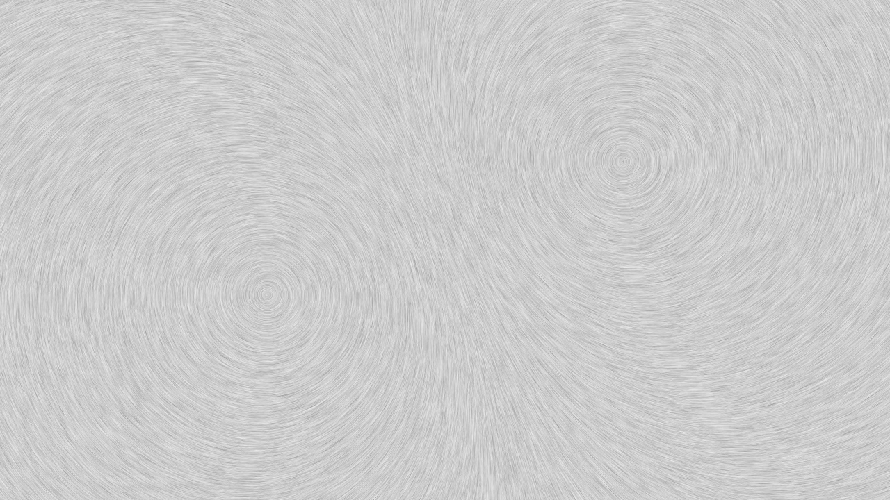

# YottaPXL

## Synopsis

YottaPXL – A browser-based canvas for rendering computationally generated pixel art, e.g. fractals or and vector fields.

## Installation & Running the App

1. Clone this
2. npm i
3. npm run start
4. Browser -> http://127.0.0.1:8080 -> dist

## Samples

